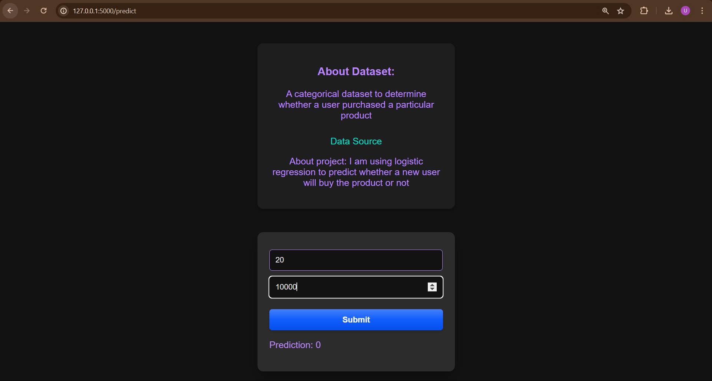
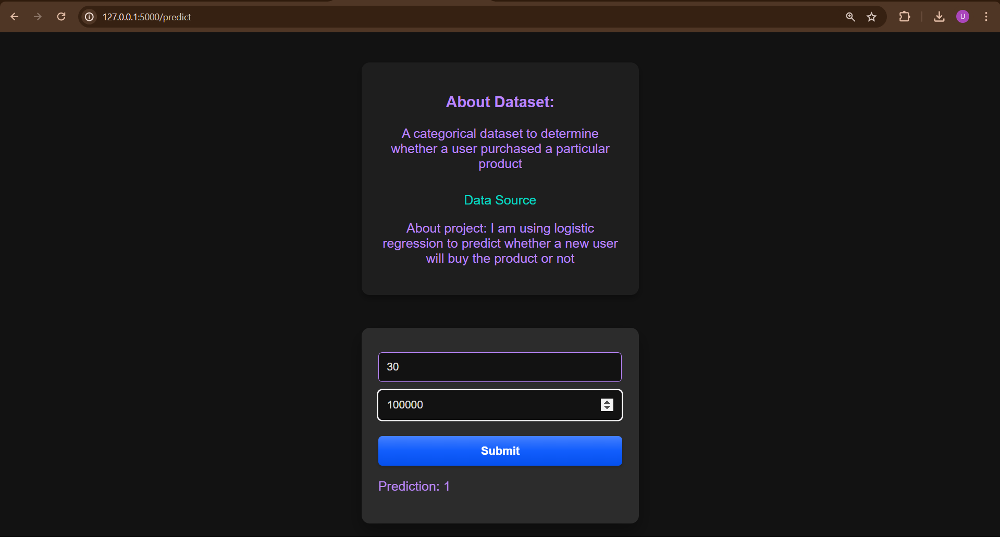

# This is a Basic Machine Learning Project 
## This is my first flask app
I had used <a href="https://www.kaggle.com/datasets/rakeshrau/social-network-ads">this </a> data and applied **Logistic Regression** to predict whether a customer will buy my product or not.  
I had downloaded my model(You can view code <a href="https://github.com/Upeshjeengar/flask-basic-project/blob/main/3_LogisticRegression.ipynb">here</a>) using **pickel** and imported it to use.

  




## How to use:
## Step 1:Download
### Method 1: Directly Download in zip format and unzip 

or use CLI
### Method 2: 
```git clone https://github.com/Upeshjeengar/flask-basic-project.git```

## Step 2: Change your directory 
```cd flask-basic-project```

## Step 3: Create a virtual environment and activate it(You may skip this step but it is prefered)

## Step 4:Install required libraries
```pip install -r requirements.txt```
(You can also use poetry to download it)

## Now ready to go run app.py using
```python app.py```   
Now go to server http://127.0.0.1:5000 to view application.
